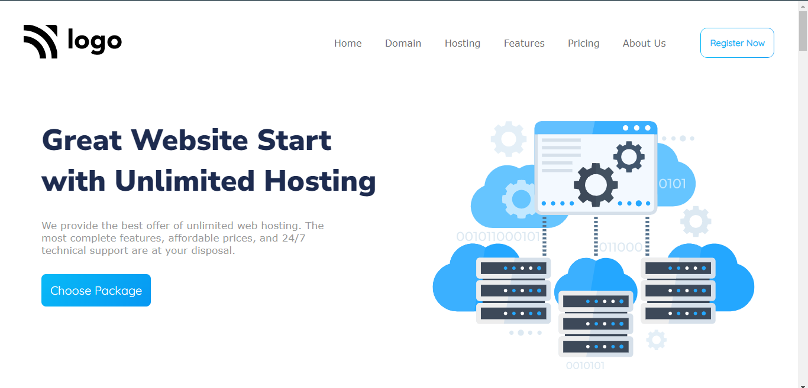
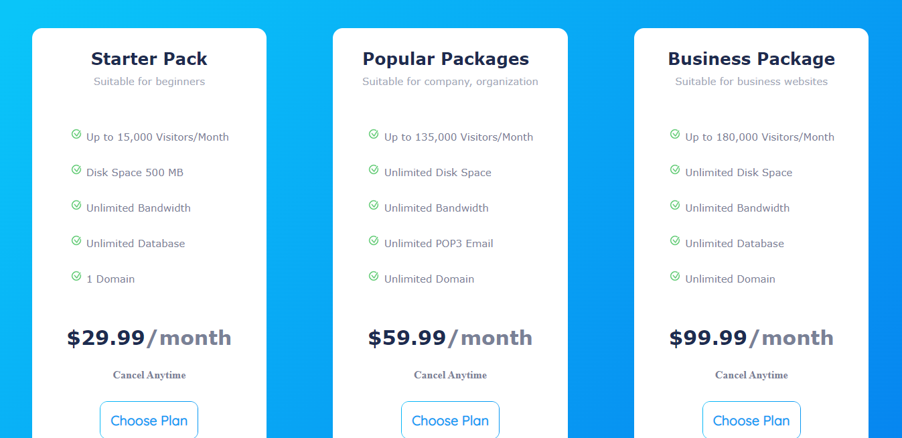
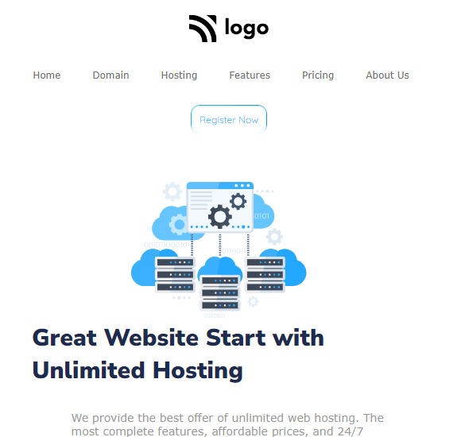
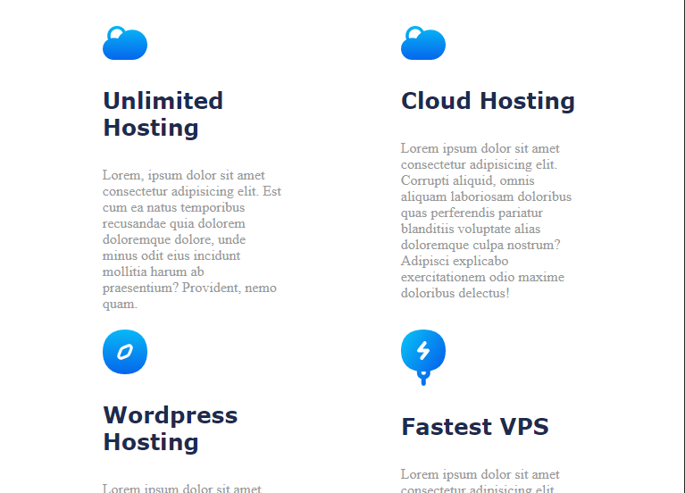
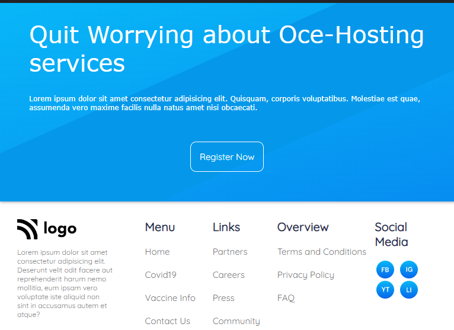

# Hosting Company's Website Design Template : 11th Website in pure HTML and CSS

---

## Description
This is a landing page designed for a hosting service provider firm in pure HTML and CSS. The overall design consists of multiple sections. The entire webpage is divided into multiple segments which are the navigation bar, cards section, service section, feature cards, testimonial, pricing section, pre-footer, and footer section. Each segment has its design paradigm based entirely on user engagement. All the buttons are designed with gradients and animations. 
 

Most of the alignment with the elements was done using `Flexbox` and its various properties. In total, I gave 14-15 hours of my time, which was divided among several sittings. In the beginning, I spent a lot of time writing HTML segments where I declared all of the crucial components like the navbar, service section, card sections, feature section, pricing panel, testimonials, pre-footer, footer, and all of their images, and icons. Selecting the correct icons, images, and their size according to the color scheme was one of the challenging tasks for me. Eventually, I spent most of my time designing and maintaining the responsiveness of each object for multiple screen sizes. In this webpage, the responsive breakpoints are at `1024px`, `768px`, and `576px`.
 

The linear gradient property was one of the most valuable things I learned from this project, apart from its HTML content and design. It was challenging to work with gradients on the buttons and borders in this project. This particular project has trained me more on `Flexbox`, `media queries, `images`, and properties along with designing aspects.

 

---

## About The Project
 

Here's a Screen-Shot of my 11th project along with the responsive snippets.

 

 

 

 

 

<!-- PROJECT LOGO -->
 

  

<h3 align="center">project 11 - Hosting Service</h3>
  
   
    <a href="https://hosting-website-project-11.netlify.app/">View Live Demo</a>
  

## Built With

**Using Technologies**

1. `HTML`
2. `CSS`
3. `MarkDown`

> The challenge of this project was to make the design responsive from scratch with pure CSS without using any frameworks .

 

## Live Project

This project is presently deployed in **`Netlify Service`**.

[Live Project URL](https://hosting-website-project-11.netlify.app/)
 

<!-- LEARNT -->
 

## Learnt
In This project I learnt the following properties of HTML and CSS.
- In depth learning of Responsive designs.
- Linear Gradient
- Flexbox and its Properties. 
- Media Queries.

 
<!-- CONTACT -->

## Contact

- **Name 👨‍💻:** [Harshal Verma](https://github.com/harshalvrm)
- **Email 📧:** [harshalvrm3@gmail.com](mailto:harshalvrm3@gmail.com)
- **Linkedln 📝:** [Click Here](https://www.linkedin.com/in/harshalvrm3/)
- **Blog 📝:** [Hashnode blog](https://xadai.hashnode.dev/)

 

[Project 11 Link](https://hosting-website-project-11.netlify.app/) 

